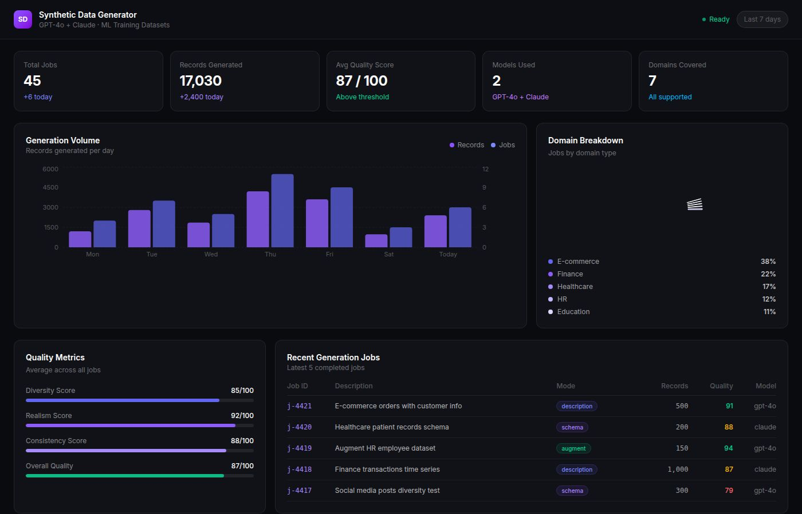
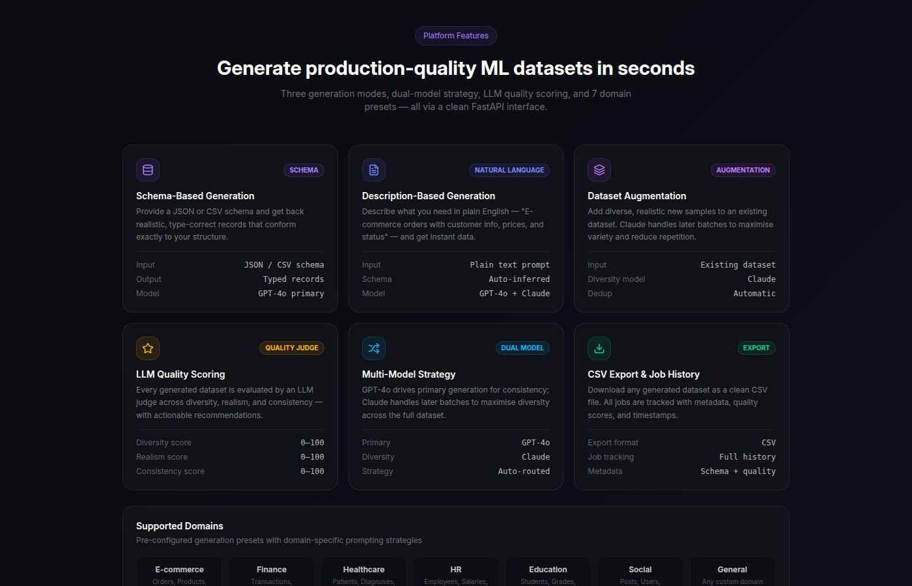
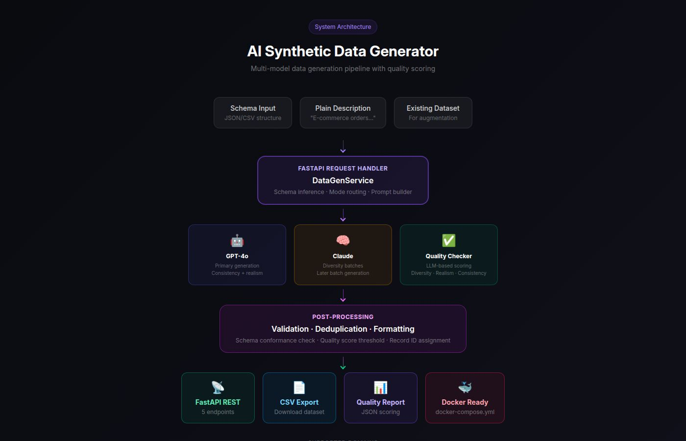

📅 Project Period: Nov 2024 – Dec 2024 | Status: Completed | Author: Bharghava Ram Vemuri

# 📊 LLM Observability & Cost Intelligence Platform

**Production-grade system for monitoring LLM applications — tracking cost, latency, hallucinations, and model drift in real time.**

---

## 📊 Observability Dashboard

Real-time visibility into token usage, cost trends, latency (P50/P95), and model performance.



---

## ⚙️ Platform Features

Comprehensive monitoring across cost, latency, quality, and reliability metrics for LLM systems.



---

## 🏗️ System Architecture

End-to-end observability pipeline wrapping LLM calls with tracking, analysis, and alerting layers.



---

## 🧠 Overview

As LLM-powered applications scale, **observability becomes essential** to ensure cost control, performance, and reliability.

This platform provides:

* Per-request cost tracking
* Latency monitoring (P50/P95)
* Hallucination detection using LLM-as-a-judge
* Drift detection against baseline responses
* Multi-model analytics across providers

---

## 🚀 Why This Matters

* LLM costs can escalate rapidly without visibility
* Latency directly impacts user experience
* Hallucinations reduce trust in AI systems
* Model outputs drift over time without detection
* No unified observability layer exists for LLM systems

---

## ⚙️ Core Capabilities

| Capability              | Description                              |
| ----------------------- | ---------------------------------------- |
| Cost Tracking           | Token usage and USD cost per request     |
| Latency Monitoring      | P50/P95 latency metrics                  |
| Hallucination Detection | LLM-based factual consistency scoring    |
| Drift Detection         | Detects degradation vs baseline outputs  |
| Multi-Model Analytics   | Compare GPT, Claude, and other models    |
| Alerts                  | Configurable cost and latency thresholds |

---

## 🔄 Observability Pipeline

```text
LLM Request
    ↓
Tracked Wrapper
    ↓
Metrics Collection
 - Token usage
 - Latency
 - Model metadata
    ↓
Analysis Layer
 - Cost calculation
 - Hallucination scoring
 - Drift detection
    ↓
Storage + Aggregation
    ↓
Dashboard + Alerts
```

---

## 📊 Example Observability Output

```json
{
  "model": "gpt-4o",
  "cost_usd": 0.021,
  "latency_ms": 1820,
  "p95_latency_ms": 4200,
  "hallucination_score": 0.18,
  "drift_score": 0.07,
  "status": "SAFE"
}
```

---

## ⚡ Quick Start

```bash
git clone https://github.com/bharghavaram/ai-observability-platform
cd ai-observability-platform
pip install -r requirements.txt
cp .env.example .env
uvicorn main:app --reload
```

---

## 🐳 Run with Docker

```bash
docker-compose up --build
```

API: http://localhost:8000
Docs: http://localhost:8000/docs

---

## 🔌 API Endpoints

| Method | Endpoint                      | Description            |
| ------ | ----------------------------- | ---------------------- |
| POST   | /api/v1/observe/call          | Track LLM call         |
| POST   | /api/v1/observe/hallucination | Evaluate hallucination |
| POST   | /api/v1/observe/drift         | Detect output drift    |
| GET    | /api/v1/observe/analytics     | Cost & latency metrics |
| GET    | /api/v1/observe/calls         | Call history           |
| GET    | /api/v1/observe/alerts        | Active alerts          |

---

## 📥 Example Request

```bash
curl -X POST "http://localhost:8000/api/v1/observe/call" \
-H "Content-Type: application/json" \
-d '{
  "prompt": "Explain transformer attention",
  "model": "gpt-4o"
}'
```

---

## 🧱 Project Structure

```text
ai-observability-platform/
├── app/services/observability_service.py
├── tests/
├── docs/images/
├── main.py
├── Dockerfile
├── docker-compose.yml
└── requirements.txt
```

---

## ⚙️ Environment Variables

```text
OPENAI_API_KEY=
ANTHROPIC_API_KEY=
LATENCY_THRESHOLD_MS=3000
COST_ALERT_THRESHOLD=5
```

---

## 🧪 Testing

```bash
pytest tests/ -v
```

---

## 🛠️ Tech Stack

* Python 3.11
* FastAPI + Uvicorn
* OpenAI & Anthropic APIs
* Docker + Docker Compose
* Pytest

---

## 🎯 Key Highlights

* Production-ready LLM observability system
* Multi-model monitoring and analytics
* LLM-as-a-judge evaluation for hallucinations
* Cost and latency optimization insights
* Real-time monitoring architecture

---

## 📌 Future Improvements

* Interactive dashboard UI (Streamlit/React)
* Model routing for cost optimization
* Advanced anomaly detection
* Integration with logging platforms (ELK, Datadog)

---

## 👨‍💻 Author

**Bharghava Ram Vemuri**
AI Engineer | LLM Systems | RAG | Multi-Agent Architectures

---
